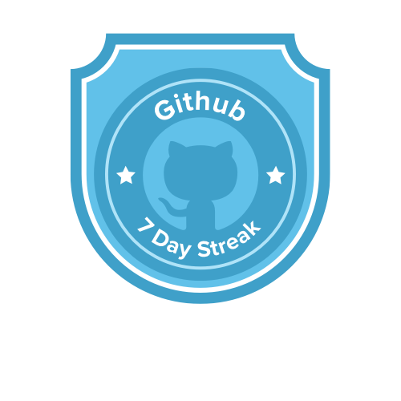
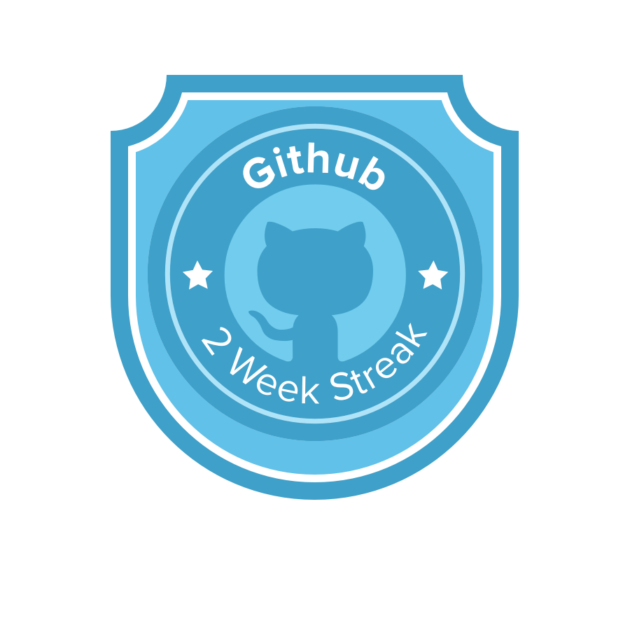

# Make Badges

Open Badges represent verifiable achievements you can earn. Badges represent a digital real world record of your skills. 

Each badge is an image combined with meta data that details the issuer, the acheivement, the recipient of the badge. 

Badges can be displayed anywhere you can put an image: in email, on your [LinkedIn profile](https://openbadges.tumblr.com/post/55809369771/how-to-display-your-open-badges-on-your-linkedin),  or on social media. 

## Badges you can earn!

The Badges below represent achievement in a range of categories. 

### GitHub

**Github** - 5 commits in a day

**GitHub** - 10 commits in a day

**GitHub** - 5 Day Streak

**GitHub** - 7 Day Streak

**GitHub** - Two Week Streak

**GitHub** - First Pull Request

<!-- Code Badges 

Badges 

JS Level 1.1 Breakout 
JS Level 1.2 Linting to professional standards 
JS Level 1.3 Networking 
JS Level 1.4 OOP 
JS Level 2.1 Map, Filter & Reduce
JS Level 2.2 React
JS Level 2.3 React Input Pattern
JS Level 2.4 Redux

JS Webpack Bundling 
JS 

React Level 1
React Level 2
React Level 3
React Level 4

JS Level 1 - Functons and Variables 
JS Level 2 - Flow Control 
JS Level 3 - Arrays and Objects 
JS Level 4 - OOP
JS Level 5 - Profesional Best Practices 
JS Level 6 - Map, Filter, and Reduce 
JS Level 7 - Networking 
JS Level 8 - Canvas 
JS Level 9 - 
JS Level 10 - Publish to nom 
JS Level 11 - 

-->